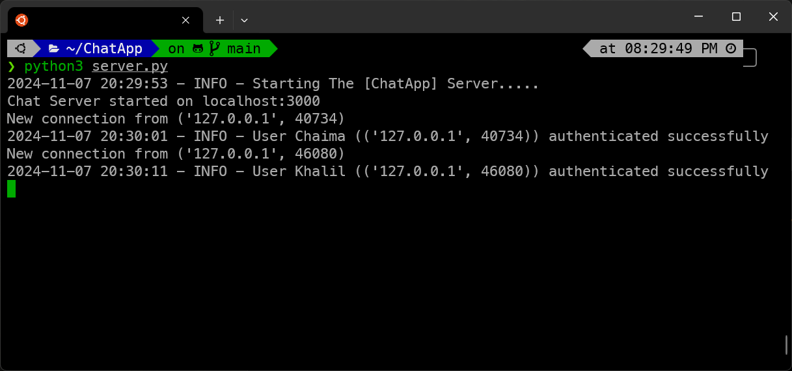

# Python Chat App

This is a multi-client chat application built using socket programming and multi-threading in Python. It allows users to connect to a central server, send and receive messages, create and join private chat channels, and perform various other chat-related functionalities.

This project is made by [khalil-hamidani](https://github.com/khalil-hamidani) and [Aymen-Ghebriou](https://github.com/Ghebriou).

## Features

1. **Core Functionality**:
   - Server can handle multiple client connections simultaneously using threads.
   - Proper connection handling and error management.
   - Maintaining a list of all connected clients.
   - Graceful client disconnection handling.
   - Proper resource cleanup.
   - Client application with a simple command-line interface.
   - Sending and receiving messages.
   - Graceful server disconnection handling.
   - Proper error handling.

2. **Private Channels**:
   - Clients can create private chat rooms.
   - Join and leave functionality for private channels.
   - Maintaining a list of available channels.

3. **Broadcasting and Message Types**:
   - Broadcast messaging to all clients.
   - Different message types (broadcast, private, channel).
   - Support for basic commands (/help, /list, /join, /leave, etc.).
   - User presence notifications.

4. **User Management**:
   - Basic user authentication.
   - Setting and changing nicknames.
   - Displaying active user list.

## Screenshots

Here are some screenshots showcasing the application:


*Server running and handling multiple client connections*


*Client application with chat functionality*


*Clients joining and chatting in a private channel*


*Clients joining and chatting in other rooms*

## Usage

To use the application, follow these steps:

1. Clone the repository:
```bash
git clone https://github.com/khalil-hamidani/ChatApp.git
```
2. Navigate to the project directory:
```bash
cd ChatApp 
```
3. Install the required dependencies:
```bash
pip install -r requirements.txt
```
4. Run the server on the first terminal:
```bash
python server.py
```
5. Run the client(s) in other terminal(s):
```bash
python client.py
```
6. Interacting with the chat application using the provided commands.

## Dependencies

- Python 3.x
- [colorama](https://pypi.org/project/colorama/) (installed via `requirements.txt`)

## Contributing

If you find any issues or have suggestions for improvements, feel free to submit a pull request or open an issue in the repository.

Or contact me on my [linkedIn](https://www.linkedin.com/in/khalil-hamidani).

## License

This project is open source so feel free to use it as you wish.